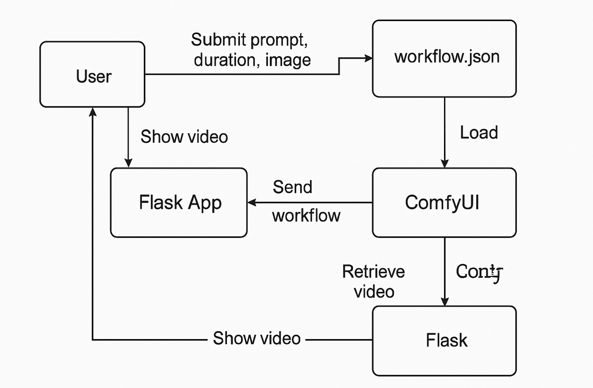

# ✅ Cấu trúc chuẩn:
```
FLASK_SCITLEARN_VIDEO_AI/
├── app/
│   ├── static/
│   │   ├── uploads/          # Lưu ảnh upload
│   │   └── videos/           # Lưu video xuất ra
│   ├── templates/
│   │   └── index.html        # Giao diện chính
│   ├── __init__.py           # Khởi tạo Flask app
│   └── routes.py             # Logic gọi ComfyUI API
├── ComfyUI/                  # Clone ComfyUI + AnimateDiff-Evolved
│   └── custom_nodes/ComfyUI-AnimateDiff-Evolved/
├── models/                   # Thư mục chứa mô hình bên ngoài ComfyUI
│   ├── stable-diffusion/
│   │   └── v1-5-pruned.ckpt
│   ├── animatediff/
│   │   └── mm_sd_v15_v2.ckpt
│   ├── controlnet/
│   │   └── control_sd15_canny.pth
│   └── vae/
│       └── vae-ft-mse-840000-ema-pruned.ckpt
├── requirements.txt
└── run.py
```
# ✅ 2. Thiết lập môi trường

```
# Tạo môi trường ảo
python -m venv venv
source venv/bin/activate  # hoặc venv\Scripts\activate trên Windows

# Cài đặt Flask và requests
pip install flask requests

```

# ✅ 3. Clone ComfyUI và AnimateDiff-Evolved

```
git clone https://github.com/comfyanonymous/ComfyUI.git
cd ComfyUI/custom_nodes
git clone https://github.com/Kosinkadink/ComfyUI-AnimateDiff-Evolved.git
```
Sau khi clone thì "Cài đặt thư viện cho ComfyUI" //Vì comfyUi là một module python hoàn chỉnh và chạy riêng lẻ như một service

```
pip install -r ComfyUI/requirements.txt
```
# ✅ 4. Tải mô hình và đặt vào thư mục models/ 
## Stable Diffusion: v1-5-pruned.ckpt → models/stable-diffusion/ ()

```
Đây là mô hình chính của Stable Diffusion 1.5, dùng để tạo ảnh từ prompt.
Bạn có thể tải từ Hugging Face, từ repository stable-diffusion-v1-5. [huggingface.co], [huggingface.co]
Ví dụ link: stable-diffusion-v1-5 on Hugging Face. [huggingface.co], [huggingface.co](https://huggingface.co/stable-diffusion-v1-5/stable-diffusion-v1-5/blob/main/v1-5-pruned.ckpt)
Có thể chọn bản .safetensors để dùng ít VRAM hơn.
```
## AnimateDiff motion module: mm_sd_v15_v2.ckpt → models/animatediff/

```
Đây là motion module dùng cho AnimateDiff, biến ảnh tĩnh hoặc prompt thành chuyển động.
Có thể tải từ Hugging Face repo của tác giả guoyww/animatediff. [huggingface.co](https://huggingface.co/guoyww/animatediff/blob/main/mm_sd_v15_v2.ckpt)
Ví dụ link: mm_sd_v15_v2.ckpt trên Hugging Face. [huggingface.co]
```


## ControlNet: control_sd15_canny.pth → models/controlnet/
```
Là mô hình ControlNet dùng để xử lý ảnh tham chiếu theo Canny edge.
Tải từ repo lllyasviel/ControlNet trên Hugging Face. [huggingface.co]
Ví dụ link: control_sd15_canny.pth trên Hugging Face. [huggingface.co](https://huggingface.co/lllyasviel/ControlNet/blob/main/models/control_sd15_canny.pth)
Có thể chọn bản .safetensors được trích xuất qua extension để dùng nhẹ hơn. [civitai.com], [huggingface.co]
```
## VAE (tùy chọn): vae-ft-mse-840000-ema-pruned.ckpt → models/vae/

```
Mô hình được lưu trữ trong repo stabilityai/sd-vae-ft-mse-original.
Bạn có thể tải trực tiếp file .ckpt bằng link:https://huggingface.co/stabilityai/sd-vae-ft-mse-original/blob/main/vae-ft-mse-840000-ema-pruned.ckpt

vae-ft-mse-840000-ema-pruned.ckpt – dung lượng khoảng 335 MB. [huggingface.co], [huggingface.co]


Đường dẫn tải:
Hugging Face – vae‑ft‑mse‑840000‑ema‑pruned.ckpt
```
# ✅ 5. Tạo Flask App -> Coi trong code đã tạo xong các file như bên dưới
```
app/__init__.py
app/routes.py
app/templates/index.html
run.py
```
# ✅ 6. Chạy dự án

1. Chạy Flask: python run.py
2. Chạy ComfyUI:

```
cd ComfyUI
python main.py --listen 0.0.0.0 --port 8188

```
### Giữ cho hai terminal luôn chạy
## Truy cập: http://127.0.0.1:5000 để input ảnh và genaral ra video

# ✅ 7. Đây là flow xử lý như sau:



```
1. User nhập prompt, thời lượng, upload ảnh → gửi đến Flask.
2. Flask App đọc workflow.json, cập nhật thông tin người dùng.
3. Flask gửi workflow đến ComfyUI API.
4. ComfyUI load mô hình (Stable Diffusion, AnimateDiff, ControlNet, VAE) và tạo video.
5. Flask poll trạng thái từ ComfyUI, lấy video trả về.
6. Flask lưu video vào app/static/videos và hiển thị cho người dùng.
```
